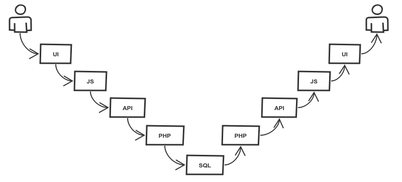

# Language

A language is a communication tool, a tool we use to express ourselves and to understand others.

Let's take a look how do we usually assume communication works:

An optimal scenario is when we express ourselves exactly how do we think and the other one understands our words exactly as they are said.
But this scenario is never true. We all have different experiences, different feelings, a different flow of ideas, different assumptions.
Language is also in comparison with our thoughts, limited. It doesn't allow us to express everything.

So if I want to express something, I have to use language. But because the language is limited, I have to express a little bit less than I want and also I have to express something a little, a little bit different. This process is called translation. In short, I translate my ideas into language.

The other person understands the language, but as discussed earlier, the other person hears something a little bit different than what was said.
Again, because the person has to translate the language into own ideas.

So, this is what happens when two people communicate in a common language:

We experience double translation even with a common language. And as we can imagine, translation means a possibility of misunderstanding, a possibility of error.

## Translation problem

When we speak with a foreigner, we have to use a language that we both understand.
Let's say I'm Czech, the foreigner is German and we both sort of speak English.

We ended up with four translations! This situation definitely causes misunderstandings and problems.

We can go back to the software sphere. In one team we usually speak by the same national language, but we have different professions, and even we speak by the same language, we imagine something different by the same terms.

I'm a programmer, I use programmers' dialect to describe problems. You would hear something like "server, version control system, code, system configuration".
A project manager uses his own dialect, something like "goal, business, deadline, meeting". When we speak with the project manager, we face an as same problem as Czechs and Germans, we have to translate from our dialect so the other one understands something and he has to translate too. So again, we end up with four translations during everyday conversation.

## Translation in an application

A typical application nowdays looks like:

Usually, the UI is designed by UX/Graphics guy, JS is done by frontend developer, API is designed by agreement between JS guy and PHP guy, PHP is done by backend developer and SQL is managed by a database specialist. When we count the user, we have 5 different people who have different ideas and think flows. We ended up with an enormous amount of translations between people and also between system parts. In this kind of project, it is almost impossible to not make a misunderstanding nor translation error. This kind of project is always a never-ending story of "idiotic users that don't understand the system" and "idiotic project managers that have no idea what is going on".

## Ubiquitous language

As we see, the most important problem in communication is translations and misunderstandings.

The solution is to use one language within the project, all team members and users. A language that comes from the underlying domain, from domain experts' language.

As we discuss problems with people who really understand the domain, with domain experts. We hear them using terms for domain concepts over and over again. We have to focus on understanding and learning these terms and also focus on using these terms in our standard communication. Once we adopt these terms, we use them in the documentation, in speech with different team members, in code while everyone understands them. And suddenly we don't have to translate these terms anymore, because they became ubiquitous. Terms created a small language, the ubiquitous language, and this language became the backbone of the project.

Once we use the ubiquitous language, translation count drastically decreases, communication and code become naturally straightforward. And what more - when a new programmer joins our team, there is no need for a senior developer to introduce everything. An underlying domain can be explained by any team member, or user, by using terms of ubiquitous language.

## TL;DR

Ubiquitous language is a subset of domain language used by all team members, domain experts, and users. It clears communication between people, an interaction between system and users and programmers' work.
